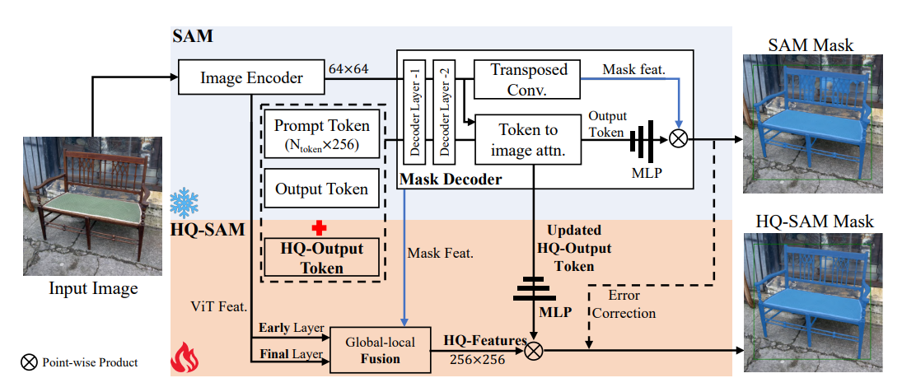
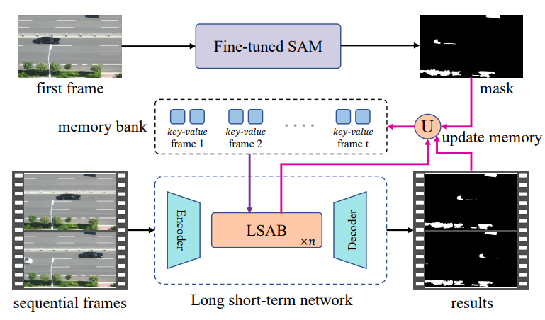
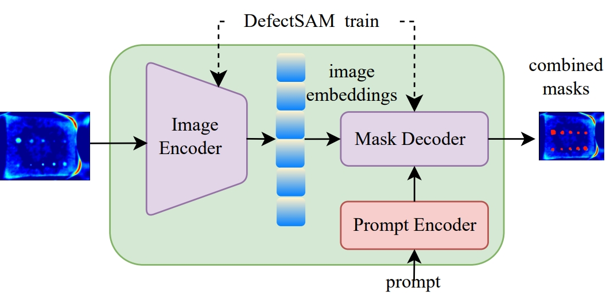
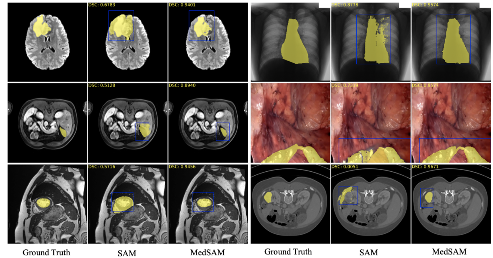
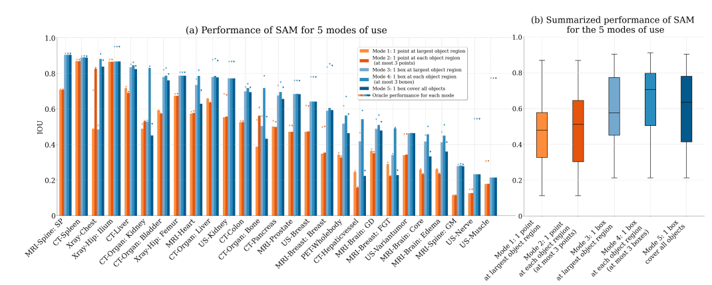
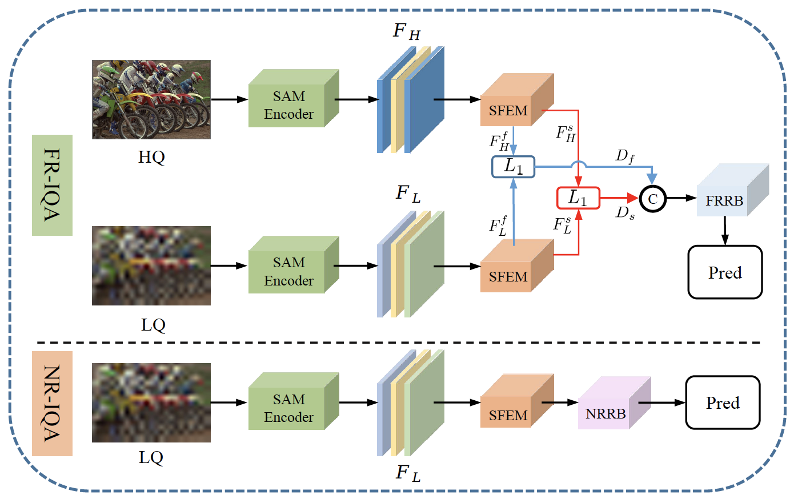
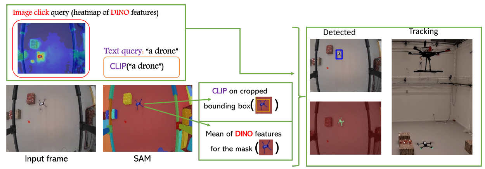
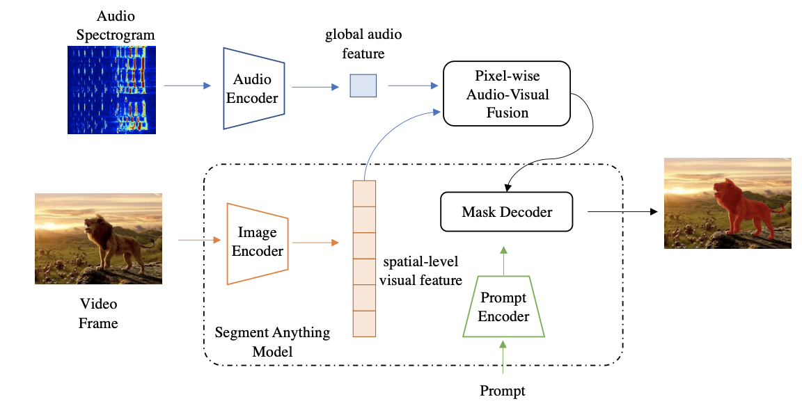

<div align="center">
<br>
<image src="./imgs/teaser.png", width="600px", height="287px">
<br>
</div>
<!--  -->

# Awesome Segment Anything [](https://github.com/sindresorhus/awesome)
Segment Anything has led to a new breakthrough in the field of Computer Vision (CV), and this repository will continue to track and summarize the research progress of Segment Anything in various fields, including Papers/Projects, etc. 

If you find this repository helpful, please consider Stars ⭐ or Sharing ⬆️. Thanks.

## News
```
- 2024.8.16 Add Segment Anything2 and SaLIP.
- 2023.8.29: Update some recent works.
- 2023.5.20: Update document structure and add a robotic-related article. Happy 520 Day！
- 2023.5.4: Add SEEM.
- 2023.4.18: Add job Inpainting Anything and SAM-Track.
- 2023.4.12: An initial version of recent papers or projects.
```

## Contents

- [Basemodel Papers](#basemodel-papers) 
- [Derivative Papers](#derivative-papers)
  - [Analysis and Expansion of SAM](#analysis-and-expansion-of-sam)
  - [Medical Image Segmentation](#medical-image-segmentation)
  - [Inpainting](#inpainting)
  - [Camouflaged Object Detection](#camouflaged-object-detection)
  - [Video Frame Interpolation](#video-frame-interpolation)
  - [Low Level Vision](#low-level-vision)
  - [Image Matting](#image-matting)
  - [Robotic](#robotic)
  - [Bioinformatics](#bioinformatics)
  - [3D](#3d)
  - [Remote Sensing](#remote-sensing)
  - [Tracking](#tracking)
  - [Audio-visual Localization and Segmentation](#audio-visual-ocalization-and-segmentation)
  - [Adversarial Attacks](#adversarial-attacks)
- [Derivative Projects](#derivative-projects) 
  - [Image Segmentation task](#image-segmentation-task)
  - [Video Segmentation task](#video-segmentation-task)
  - [Medical image Segmentation task](#medical-image-segmentation-task)
  - [Inpainting task](#inpainting-task)
  - [3D task](#3d-task)
  - [Image Generation task](#image-generation-task)
  - [Remote Sensing task](#remote-sensing-task)
  - [Moving Object Detection task](#moving-object-detection-task)
  - [OCR task](#ocr-task)
- [front-end framework](#front-end-framework)
   - [JS SDK for SAM](#samjs)

## Papers/Projects
### Basemodel Papers
| Title |Presentation| Paper page | Project page | Code base | Affiliation| Description|
|:---:|:---:|:---:|:---:| :---:| :---:|:---:|
| CLIP |  | [arXiv](https://arxiv.org/abs/2103.00020) | [Colab](https://colab.research.google.com/github/openai/clip/blob/master/notebooks/Interacting_with_CLIP.ipynb) | [Code](https://github.com/openai/CLIP) | OpenAI | Contrastive Language-Image Pre-Training.| 
| OWL-ViT | | [ECCV2022](https://arxiv.org/abs/2205.06230) | - | [Code](https://github.com/google-research/scenic/tree/main/scenic/projects/owl_vit) | Google | A open-vocabulary object detector. | 
| OvSeg |  | [CVPR2023](https://arxiv.org/abs/2210.04150) | [Project](https://jeff-liangf.github.io/projects/ovseg/) | [Code](https://github.com/facebookresearch/ov-seg) | META | Segment an image into semantic regions according to text descriptions.| 
| Painter |  | [CVPR2023](https://arxiv.org/abs/2212.02499) | - | [Code](https://github.com/baaivision/Painter) | BAAI | A Generalist Painter for In-Context Visual Learning.| 
| Grounding DINO | | [arXiv](https://arxiv.org/abs/2303.05499) | [Colab](https://colab.research.google.com/github/roboflow-ai/notebooks/blob/main/notebooks/zero-shot-object-detection-with-grounding-dino.ipynb) &[Huggingface](https://huggingface.co/spaces/ShilongLiu/Grounding_DINO_demo) | [Code](https://github.com/IDEA-Research/GroundingDINO) | IDEA | A stronger open-set object detector|
| Segment Anything | | [arXiv](https://arxiv.org/abs/2304.02643) | [Project page](https://segment-anything.com/) | [Code](https://github.com/facebookresearch/segment-anything) | Meta | A stronger Large model which can be used to generate masks for all objects in an image.| 
| SegGPT | | [arXiv](https://arxiv.org/abs/2304.03284) | [Project page](https://huggingface.co/spaces/BAAI/SegGPT) | [Code](https://github.com/baaivision/Painter) | BAAI | Segmenting Everything In Context based on Painter.|
| Segment Everything Everywhere All at Once (SEEM) |  |[arXiv](https://arxiv.org/pdf/2304.06718.pdf) | [Project Page](https://huggingface.co/spaces/xdecoder/SEEM) | [Code](https://github.com/UX-Decoder/Segment-Everything-Everywhere-All-At-Once)| Microsoft | Semantic Segmentation with various prompt types.|
| Segment Everything2  | ) |[Paper]([https://arxiv.org/pdf/2304.06718.pdf](https://scontent-fmx1-1.xx.fbcdn.net/v/t39.2365-6/453626691_1879405402541497_3155007177325245432_n.pdf?_nc_cat=106&ccb=1-7&_nc_sid=3c67a6&_nc_ohc=lkNRHLYBebIQ7kNvgHl-Sjg&_nc_ht=scontent-fmx1-1.xx&oh=00_AYBDsA5Jo0xafWqN9cTfq7tklJ9QHxbyyzLnvg5qCaG6kw&oe=66C4AD0C)) | [Project Page]([https://huggingface.co/spaces/xdecoder/SEEM](https://ai.meta.com/sam2/)) | [Code]([https://github.com/UX-Decoder/Segment-Everything-Everywhere-All-At-Once](https://github.com/facebookresearch/segment-anything-2?tab=readme-ov-file))| Meta | A foundation model towards solving promptable visual segmentation in images and videos..|

### Derivative Papers

#### Analysis and Expansion of SAM
| Title | Presentation| Paper page | Project page | Code base | Affiliation| Description|
|:---:|:---:|:---:|:---:| :---:| :---:|:---:|
| CLIP_Surgery | | [arXiv](https://arxiv.org/pdf/2304.05653.pdf) |[Demo](https://github.com/xmed-lab/CLIP_Surgery/blob/master/demo.ipynb)| [Code](https://github.com/xmed-lab/CLIP_Surgery) | HKUST | This work about SAM based on CLIP's explainability to achieve text to mask without manual points.|
|GenSAM |  | [arXiv](https://arxiv.org/abs/2312.07374) | [Project Page](https://lwpyh.github.io/GenSAM/) | [Code](https://github.com/jyLin8100/GenSAM) | QMUL | This work relaxes the requirement for instance-specific prompts in SAM.|
| Segment Anything Is Not Always Perfect |  | [arXiv](https://arxiv.org/pdf/2304.05750.pdf) | - | - | Samsung | This paper analyzes and discusses the benefits and limitations of SAM.|
| PerSAM |  | [arXiv](https://arxiv.org/abs/2305.03048) | [Project Page](https://huggingface.co/papers/2305.03048) | [Code](https://github.com/ZrrSkywalker/Personalize-SAM) | - |Segment Anything with specific concepts. |
| Matcher: Segment Anything with One Shot Using All-Purpose Feature Matching |  | [arXiv](https://arxiv.org/abs/2305.13310) | - | [Code](https://github.com/aim-uofa/Matcher) | - | One shot semantic segmentation by integrating an all-purpose feature extraction model and a class-agnostic segmentation model. |
| Segment Anything in High Quality | | [arXiv](https://arxiv.org/pdf/2306.01567.pdf) | [Project Page](https://huggingface.co/papers/2306.01567) | - | ETH Zürich & HKUST | HQ-SAM: improve segmentation quality of SAM using learnable High-Quality Output Token. |
|Detect Any Shadow: Segment Anything for Video Shadow Detection|  | [arXiv](https://arxiv.org/pdf/2305.16698.pdf) | - | [Code](https://github.com/harrytea/Detect-AnyShadow) | University of Science and Technology of China | Use SAM to detect initial frames then use an LSTM network for subsequent frames. |
| Fast Segment Anything |  | [arXiv](https://arxiv.org/pdf/2306.12156v1.pdf) | [Project Page](https://huggingface.co/spaces/An-619/FastSAM) | [Code](https://github.com/casia-iva-lab/fastsam) | - | Reformulate the architecture and improve the speed of SAM. | 
| MobileSAM (Faster Segment Anything) |  | [arXiv](https://arxiv.org/pdf/2306.14289.pdf) | [Project Page](https://huggingface.co/papers/2306.14289) | [Code](https://github.com/ChaoningZhang/MobileSAM) | Kyung Hee University | make SAM mobile-friendly by replacing the heavyweight image encoder with a lightweight one.|
| FoodSAM (Any Food Segmentation) |  | [arxiv](https://arxiv.org/abs/2308.05938) | [Project Page](https://starhiking.github.io/FoodSAM_Page/) | [Code](https://github.com/jamesjg/FoodSAM) | UCAS | semantic, instance, panoptic, interactive segmentation on food image.|
| DefectSAM |  | [arxiv](https://arxiv.org/abs/2311.10245) | - | [Code](https://github.com/bozhenhhu/DefectSAM) | ZJU, Westlake, UESTC, etc. | infrared thermal images, defect detection.|
| SlimSAM |  | [arxiv](https://arxiv.org/abs/2312.05284) | - | [Code](https://github.com/czg1225/SlimSAM) | NUS | 0.1% Data Makes Segment Anything Slim.|

#### Medical Image Segmentation
| Title | Presentation| Paper page | Project page | Code base | Affiliation| Description|
|:---:|:---:|:---:|:---:| :---:| :---:|:---:|
| Segment Anything Model (SAM) for Digital Pathology |  | [arXiv](https://arxiv.org/abs/2304.04155) | - | - | - | SAM + Tumor segmentation/Tissue segmentation/Cell nuclei segmentation. |
| Segment Anything in Medical Images | |[arXiv](https://arxiv.org/pdf/2304.12306.pdf)| - |[Code](https://github.com/bowang-lab/MedSAM) | - | A step-by-step tutorial with a small dataset to help you quickly utilize SAM.|
| SAM Fails to Segment Anything? | |[arXiv](https://arxiv.org/pdf/2304.09148.pdf)| - |[Code](https://github.com/tianrun-chen/SAM-Adapter-PyTorch) | - | SAM-adapter: Adapting SAM in Underperformed Scenes: Camouflage, Shadow, Medical Image Segmentation, and More.|
| Segment Anything Model for Medical Image Analysis: an Experimental Study |  | [arXiv](https://arxiv.org/pdf/2304.10517.pdf) | - | - | - | Thorough experiments evaluating how SAM performs on 19 medical image datasets. |
| Medical-SAM-Adapter |  | [arXiv](https://arxiv.org/abs/2304.12620.pdf) | - | [Code](https://github.com/KidsWithTokens/Medical-SAM-Adapter) | - | A project to finetune SAM using Adaption for the Medical Imaging. |
| SAM-Med2d |  | [arXiv](https://arxiv.org/abs/2308.16184) | - | [Code](https://github.com/OpenGVLab/SAM-Med2D) | Sichuan University & Shanghai AI Laboratory | The most comprehensive studies on applying SAM to medical 2D images |
| ScribblePrompt-SAM |  | [arXiv](https://arxiv.org/abs/2312.07381) | [Project Page](https://scribbleprompt.csail.mit.edu/) | [Code](https://github.com/halleewong/ScribblePrompt) | MIT & MGH | Fine-tuned SAM on 65 biomedical imaging datasets with scribble, click, and bounding box inputs |
| SaLIP | - | [arXiv]([https://arxiv.org/abs/2312.07381](https://arxiv.org/abs/2404.06362)) | [Project Page](https://scribbleprompt.csail.mit.edu/) | [Code]([https://github.com/halleewong/ScribblePrompt](https://github.com/aleemsidra/SaLIP)) | - | Test-Time Adaptation with SaLIP: A Cascade of SAM and CLIP for Zero-shot
Medical Image Segmentation. |
#### Bioimage Analysis
| Title | Presentation| Paper page | Project page | Code base | Affiliation| Description|
|:---:|:---:|:---:|:---:| :---:| :---:|:---:|
| Segment Anything for Microscopy |  | [bioRxiv](https://doi.org/10.1101/2023.08.21.554208) | [Demo](https://computational-cell-analytics.github.io/micro-sam/micro_sam.html#installation) | [Code](https://github.com/computational-cell-analytics/micro-sam) | University of Göttingen, Germany | Segment Anything for Microscopy implements automatic and interactive annotation for microscopy data. It is built on top of Segment Anything and specializes it for microscopy and other bio-imaging data. Its core components are: <ul><li>The `micro_sam` tools for interactive data annotation with napari.</li><li>The `micro_sam` library to apply Segment Anything to 2d and 3d data or fine-tune it on your data.</li><li>The `micro_sam` models that are fine-tuned on publicly available microscopy data.</li> Our goal is to build fast and interactive annotation tools for microscopy data |

#### Inpainting
| Title | Presentation| Paper page | Project page | Code base | Affiliation| Description|
|:---:|:---:|:---:|:---:| :---:| :---:|:---:|
| Inpaint Anything | |[arXiv](https://arxiv.org/abs/2304.06790)| - |[Code](https://github.com/geekyutao/Inpaint-Anything) | USTC & EIT | SAM + Inpainting, which is able to remove the object smoothly.|
| SAM + Stable Diffusion for Text-to-Image Inpainting |  | - | [Project](https://www.comet.com/examples/demo-text-to-inpainting-sam-stablediffusion/view/bRnI022tXQUdKGsVCFmjFRRtT/) | [Code](https://colab.research.google.com/drive/1B7L4cork9UFTtIB02EntjiZRLYuqJS2b#scrollTo=LtZghyHoJabf) | comet | Grounding DINO + SAM + Stable Diffusion |

#### Camouflaged Object Detection
| Title | Presentation| Paper page | Project page | Code base | Affiliation| Description|
|:---:|:---:|:---:|:---:| :---:| :---:|:---:|
| SAMCOD | - | [arXiv](https://arxiv.org/abs/2304.04709) | - | [Code](https://github.com/luckybird1994/SAMCOD) | - | SAM + Camouflaged object detection (COD) task.|

#### Video Frame Interpolation
| Title | Presentation| Paper page | Project page | Code base | Affiliation| Description|
|:---:|:---:|:---:|:---:| :---:| :---:|:---:|
| Clearer Frames, Anytime: Resolving Velocity Ambiguity in Video Frame Interpolation |  | [arXiv](https://arxiv.org/abs/2311.08007) | [Project Page](https://zzh-tech.github.io/InterpAny-Clearer/) & [Interactive Demo](http://ai4sports.opengvlab.com/interpany-clearer/) | [Code](https://github.com/zzh-tech/InterpAny-Clearer) | Shanghai AI Laboratory & Snap Inc. | Editable video frame interpolation with SAM. |

#### Low Level Vision
| Title | Presentation| Paper page | Project page | Code base | Affiliation| Description|
|:---:|:---:|:---:|:---:| :---:| :---:|:---:|
| Segment Anything in Video Super-resolution | |[arXiv](https://arxiv.org/pdf/2305.06524.pdf)| - | - | - | The first step to use SAM for low-level vision.|
| SAM-IQA | |[arXiv](https://arxiv.org/pdf/2307.04455.pdf)| - | [Code](https://github.com/Hedlen/SAM-IQA) | Megvii | The first to introduce the SAM in IQA and demonstrate its strong generalization ability in this domain.|

#### Image Matting
| Title | Presentation| Paper page | Project page | Code base | Affiliation| Description|
|:---:|:---:|:---:|:---:| :---:| :---:|:---:|
|Matte Anything||[arXiv](https://arxiv.org/abs/2306.04121)| - | [Code](https://github.com/hustvl/Matte-Anything)| HUST Vision Lab| An interactive natural image matting system with excellent performance for both opaque and transparent objects |
| Matting Anything |  | [arXiv](https://arxiv.org/abs/2306.05399) | [Project page](https://huggingface.co/papers/2306.05399) | [Code](https://github.com/SHI-Labs/Matting-Anything) | SHI Labs | Leverage feature maps from SAM and adopts a Mask-to-Matte module to predict the alpha matte. |

#### Robotic
| Title | Presentation| Paper page | Project page | Code base | Affiliation| Description|
|:---:|:---:|:---:|:---:| :---:| :---:|:---:|
| Instruct2Act | |[arXiv](https://arxiv.org/pdf/2305.11176.pdf)| - | [Code](https://github.com/OpenGVLab/Instruct2Act) | OpenGVLab | A SAM application in the Robotic field.|

#### Bioinformatics
| Title | Presentation| Paper page | Project page | Code base | Affiliation| Description|
|:---:|:---:|:---:|:---:| :---:| :---:|:---:|
| IAMSAM | |[bioRxiv](https://www.biorxiv.org/content/10.1101/2023.05.25.542052v1)| - | [Code](https://github.com/portrai-io/IAMSAM) | Portrai Inc. | A SAM application for the analysis of Spatial Transcriptomics.|  
  
#### 3D
| Title | Presentation| Paper page | Project page | Code base | Affiliation| Description|
|:---:|:---:|:---:|:---:| :---:| :---:|:---:|
| Point-SAM| |[arXiv](https://arxiv.org/abs/2406.17741)| [Page](https://point-sam.github.io) | [Code](https://github.com/zyc00/Point-SAM) | UCSD | An open-world 3D native promptable point-cloud segmentation method.|
| SAMPro3D | |[arXiv](https://arxiv.org/abs/2311.17707)| [Page](https://mutianxu.github.io/sampro3d/) | [Code](https://github.com/GAP-LAB-CUHK-SZ/SAMPro3D) | CUHKSZ, MSRA |A novel method to segment any 3D indoor scenes by applying the SAM to 2D frames, without need any training, tuning, distillation or 3D pretrained networks.|
| Seal | |[arXiv](https://arxiv.org/abs/2306.09347)| [Page](https://ldkong.com/Seal) | [Code](https://github.com/youquanl/Segment-Any-Point-Cloud) | - | A framework capable of leveraging 2D vision foundation models for self-supervised learning on large-scale 3D point clouds.|
| TomoSAM |  | [arXiv](https://arxiv.org/pdf/2306.08609.pdf) | [Video Tutorial](https://www.youtube.com/watch?v=4nXCYrvBSjk) | [Code](https://github.com/fsemerar/SlicerTomoSAM) | - | An extension of 3D Slicer using the SAM to aid the segmentation of 3D data from tomography or other imaging techniques. |
| SegmentAnythingin3D |  | [arXiv](https://arxiv.org/abs/2304.12308.pdf) | [Project](https://jumpat.github.io/SA3D/) | [Code](hhttps://github.com/Jumpat/SegmentAnythingin3D) | - | A novel framework to Segment Anything in 3D, named SA3D. |

#### Remote Sensing
| Title | Presentation| Paper page | Project page | Code base | Affiliation| Description|
|:---:|:---:|:---:|:---:| :---:| :---:|:---:|
| RSPrompter |  | [arXiv](https://arxiv.org/pdf/2306.16269.pdf) | [Project Page](https://kyanchen.github.io/RSPrompter/) | [Code](https://github.com/KyanChen/RSPrompter) | Beihang University | An automated instance segmentation approach for remote sensing images based on the SAM. |
| SAM-CD |  | [arXiv](https://arxiv.org/abs/2309.01429) | - | [Code](https://github.com/ggsDing/SAM-CD) | PLA Information Engineering University | A sample-efficient change detection framework that employs SAM as the visual encoder. |
| SAM-Road: Segment Anything Model for Road Network Graph Extraction |  | [arXiv](http://arxiv.org/abs/2403.16051) | - | [Code](https://github.com/htcr/sam_road) | Carnegie Mellon University | A simple and fast method applying SAM for vectorized large-scale road network graph extraction. It reaches state-of-the-art accuracy while being 40 times faster. |

#### Tracking
| Title | Presentation| Paper page | Project page | Code base | Affiliation| Description|
|:---:|:---:|:---:|:---:| :---:| :---:|:---:|
| Follow Anything |  | [arXiv](https://arxiv.org/abs/2308.05737) | [Page](https://huggingface.co/papers/2308.05737) | [Code](https://github.com/alaamaalouf/FollowAnything) | MIT, Harvard University | an open-vocabulary and multimodal model to detects, tracks, and follows any objects in real-time.|
| Track-Anything | [Video](https://github.com/gaomingqi/Track-Anything/raw/master/assets/avengers.gif) | [arXiv](https://arxiv.org/abs/2304.11968) | - | [Code](https://github.com/gaomingqi/Track-Anything) | MIT, Harvard University | an open-vocabulary and multimodal model to detects, tracks, and follows any objects in real-time.|
| SAM-Track | [Video](https://camo.githubusercontent.com/149f974fc6e13f3764e30d843880fa1e15e0fbecf607f905805d84290ec87155/68747470733a2f2f7265732e636c6f7564696e6172792e636f6d2f6d6172636f6d6f6e74616c62616e6f2f696d6167652f75706c6f61642f76313638313731333039352f766964656f5f746f5f6d61726b646f776e2f696d616765732f796f75747562652d2d555068747066316b3648412d63303562353861633665623463343730303833316232623330373063643430332e6a7067) | [arXiv](https://arxiv.org/abs/2305.06558) | - | [Code](https://github.com/z-x-yang/Segment-and-Track-Anything) | MIT, Harvard University | A framework called Segment And Track Anything (SAMTrack) that allows users to precisely and effectively segment and track any object in a video.|

#### Audio-visual Localization and Segmentation
| Title | Presentation| Paper page | Project page | Code base | Affiliation| Description|
|:---:|:---:|:---:|:---:| :---:| :---:|:---:|
| AV-SAM |  | [arXiv](https://arxiv.org/pdf/2305.01836.pdf) | - | [Code](https://github.com/alaamaalouf/FollowAnything) | CMU | A simple yet effective audio-visual localization and segmentation framework based on the SAM.|

#### Adversarial Attacks
| Title | Presentation| Paper page | Project page | Code base | Affiliation| Description|
|:---:|:---:|:---:|:---:| :---:| :---:|:---:|
| Attack-SAM | - | [arXiv](https://arxiv.org/pdf/2305.00866.pdf) | - | - | KAIST | The
first work of conduct a comprehensive investigation on how to attack SAM with adversarial
examples.|

### Derivative Projects
#### Image Segmentation task
| Title | Presentation|  Project page | Code base | Affiliation| Description|
|:---:|:---:|:---:|:---:| :---:| :---:|
| Grounded Segment Anything | |[Colab](https://github.com/camenduru/grounded-segment-anything-colab) & [Huggingface](https://huggingface.co/spaces/yizhangliu/Grounded-Segment-Anything) | [Code](https://github.com/IDEA-Research/Grounded-Segment-Anything) | - | Combining Grounding DINO and Segment Anything| - | 
| GroundedSAM Anomaly Detection |  | - | [Code](https://github.com/caoyunkang/GroundedSAM-zero-shot-anomaly-detection)| - | Grounding DINO + SAM to segment any anomaly. |
| Semantic Segment Anything |  |- | [Code](https://github.com/fudan-zvg/Semantic-Segment-Anything) | Fudan | A dense category annotation engine. |
| Magic Copy |  | - |[Code](https://github.com/kevmo314/magic-copy) | - | Magic Copy is a Chrome extension that uses SAM. |
| YOLO-World + EfficientViT SAM |  | 🤗 [HuggingFace Space](https://huggingface.co/spaces/curt-park/yolo-world-with-efficientvit-sam) | [Code](https://github.com/Curt-Park/yolo-world-with-efficientvit-sam) | - | Efficient open-vocabulary object detection and segmentation with YOLO-World + EfficientViT SAM |
| Segment Anything with Clip |  | 🤗 [HuggingFace Space](https://huggingface.co/spaces/curt-park/segment-anything-with-clip) |[Code](https://github.com/Curt-Park/segment-anything-with-clip) | -  | SAM + CLIP| 
| SAM-Clip |  | - |[Code](https://github.com/maxi-w/CLIP-SAM) | - | SAM + CLIP.|
| Prompt Segment Anything | | - | [Code](https://github.com/RockeyCoss/Prompt-Segment-Anything)| - | SAM + Zero-shot Instance Segmentation.|
| RefSAM | - | - |[Code](https://github.com/helblazer811/RefSAM) | - | Evaluating the basic performance of SAM on the Referring Image segmentation task.| 
| SAM-RBox |  | - |[Code](https://github.com/Li-Qingyun/sam-mmrotate) | - | An implementation of SAM for generating rotated bounding boxes with MMRotate.|
| Open Vocabulary Segment Anything | | - |[Code](https://github.com/ngthanhtin/owlvit_segment_anything) | - | An interesting demo by combining OWL-ViT of Google and SAM.|
| SegDrawer | | - |[Code](https://github.com/lujiazho/SegDrawer) | - | Simple static web-based mask drawer, supporting semantic drawing with SAM.|
| AnyLabeling | | [YoutubeDemo](https://www.youtube.com/watch?v=5qVJiYNX5Kk) |[Code](https://github.com/vietanhdev/anylabeling) | - | SAM + Labelme + LabelImg + Auto-labeling.|
| ISAT with segment anything | | [YoutubeDemo](https://www.youtube.com/watch?v=yLdZCPmX-Bc) [BiliBili Demo](https://www.bilibili.com/video/BV1or4y1R7EJ/) | [Code](https://github.com/yatengLG/ISAT_with_segment_anything) | - | Labeling tool by SAM(segment anything model),supports SAM, sam-hq, MobileSAM EdgeSAM etc.|
| Annotation Anything Pipeline | | - |[Code](https://github.com/Yuqifan1117/Annotation-anything-pipeline) | - | GPT + SAM.|
| Roboflow Annotate | | [App](https://app.roboflow.com) |[Blog](https://blog.roboflow.com/label-data-segment-anything-model-sam/) | Roboflow | SAM-assisted labeling for training computer vision models.|
| SALT | | - |[Code](https://github.com/anuragxel/salt) | - | A tool that adds a basic interface for image labeling and saves the generated masks in COCO format.]
| SAM U Specify | | - |[Code](https://github.com/MaybeShewill-CV/segment-anything-u-specify) | - | Use SAM and CLIP model to segment unique instances you want.]
| SAM web UI | | [App](https://segment-anything-webui.vercel.app/) |[Code](https://github.com/Kingfish404/segment-anything-webui/) | - | This is a new web interface for the SAM.|
| Finetune Anything |  | - | [Code](https://github.com/ziqi-jin/finetune-anything) | - |A class-aware one-stage tool for training fine-tuning models based on SAM.|
| NanoSAM |  | - | [Code](https://github.com/NVIDIA-AI-IOT/nanosam) | NVIDIA |A distilled Segment Anything (SAM) model capable of running real-time with NVIDIA TensorRT.|

#### Video Segmentation task
| Title | Presentation| Project page | Code base | Affiliation| Description|
|:---:|:---:|:---:|:---:| :---:| :---:| 
| MetaSeg |  |[HuggingFace](https://huggingface.co/spaces/ArtGAN/Segment-Anything-Video) |[Code](https://github.com/kadirnar/segment-anything-video) | - | SAM + Video. |
| SAM-Track | [Video](https://www.youtube.com/watch?v=UPhtpf1k6HA&feature=youtu.be&themeRefresh=1) |[YoutubeDemo](https://www.youtube.com/watch?v=Xyd54AngvV8) |[Code](https://github.com/z-x-yang/Segment-and-Track-Anything) | Zhejiang University | This project, which is based on SAM and DeAOT, focuses on segmenting and tracking objects in videos. |

#### Medical image Segmentation task
| Title | Presentation|  Project page | Code base | Affiliation| Description|
|:---:|:---:|:---:|:---:| :---:| :---:| 
| SAM in Napari |[Video](https://www.youtube.com/watch?v=OPE1Xnw487E)|- |[Code](https://github.com/MIC-DKFZ/napari-sam) | - | Segment anything with Napari integration of SAM.|
| SAM Medical Imaging ||- |[Code](https://github.com/amine0110/SAM-Medical-Imaging) | - | SAM for Medical Imaging.|

#### Inpainting task
| Title | Presentation|  Project page | Code base | Affiliation| Description|
|:---:|:---:|:---:|:---:| :---:| :---:| 
| SegAnythingPro | |- |[Code](https://github.com/jinfagang/Disappear) | - | SAM + Inpainting/Replacing.|


#### 3D task
| Title | Presentation|  Project page | Code base | Affiliation| Description|
|:---:|:---:|:---:|:---:| :---:| :---:| 
| 3D-Box | |- |[Code](https://github.com/dvlab-research/3D-Box-Segment-Anything) | - | SAM is extended to 3D perception by combining it with VoxelNeXt.|
| Anything 3DNovel View | |- |[Code](https://github.com/Anything-of-anything/Anything-3D) | - | SAM + [Zero 1-to-3](https://github.com/cvlab-columbia/zero123).|
| Any 3DFace | |- |[Code](https://github.com/Anything-of-anything/Anything-3D) | - | SAM + [HRN](https://younglbw.github.io/HRN-homepage/).|
| Segment Anything 3D |  | - | [Code](https://github.com/Pointcept/SegmentAnything3D) | Pointcept | Extending Segment Anything to 3D perception by transferring the segmentation information of 2D images to 3D space|

#### Image Generation task
| Title | Presentation| Project page | Code base | Affiliation| Description|
|:---:|:---:|:---:|:---:| :---:| :---:| 
| Edit Anything |  | - |[Code](https://github.com/sail-sg/EditAnything) | - | Edit and Generate Anything in an image.|
| Image Edit Anything || - |[Code](https://github.com/feizc/IEA) | - | Stable Diffusion + SAM.|
| SAM for Stable Diffusion Webui || - |[Code](https://github.com/continue-revolution/sd-webui-segment-anything) | - | Stable Diffusion + SAM.|

#### Remote Sensing task
| Title | Presentation| Project page | Code base | Affiliation| Description|
|:---:|:---:|:---:|:---:| :---:| :---:| 
| Earth Observation Tools |  |[Colab](https://colab.research.google.com/drive/1RC1V68tD1O-YissBq9nOvS2PHEjAsFkA?usp=share_link) |[Code](https://github.com/aliaksandr960/segment-anything-eo) | - | SAM + Remote Sensing. |

#### Moving Object Detection task
| Title | Presentation| Project page | Code base | Affiliation| Description|
|:---:|:---:|:---:|:---:| :---:| :---:| 
| Moving Object Detection |  | - |[Code](https://github.com/achalddave/segment-any-moving) | - | SAM + Moving Object Detection. |


#### OCR task
| Title | Presentation| Project page | Code base | Affiliation| Description|
|:---:|:---:|:---:|:---:| :---:| :---:| 
| OCR-SAM |  | [Blog](https://www.zhihu.com/question/593914819/answer/2976012032)|[Code](https://github.com/yeungchenwa/OCR-SAM) | - | Optical Character Recognition with SAM. |

### front-end framework

#### SAMJS
| Title | Presentation| Project page | Code base | Affiliation| Description|
|:---:|:---:|:---:|:---:| :---:| :---:| 
| SAMJS |  | [demo](http://samjs.antv.vision/demos)|[Code](https://github.com/antvis/SAMJS) | - | JS SDK for SAM, Support remote sensing data segmentation and vectorization|

## Acknowledgement
Some of the presentations in this repository are borrowed from the original author, and we are very thankful for their contribution.

## License
This project is released under the MIT license. Please see the [LICENSE](LICENSE) file for more information.
