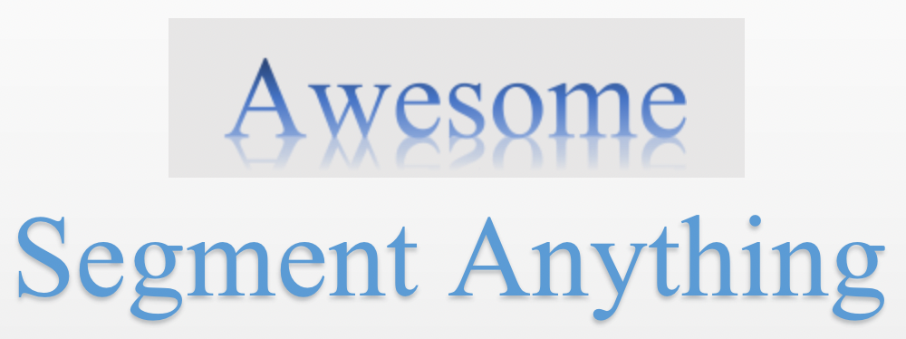
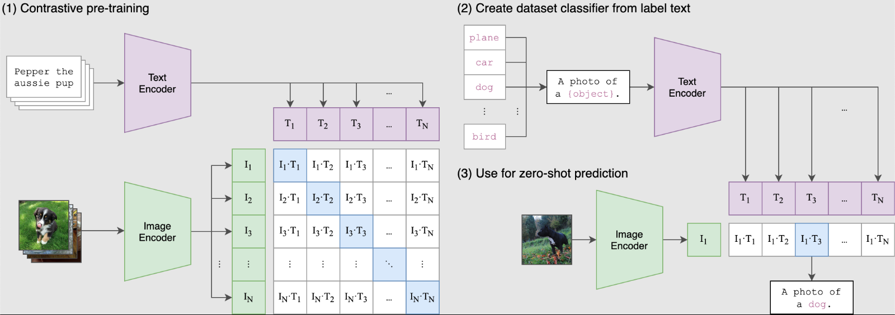
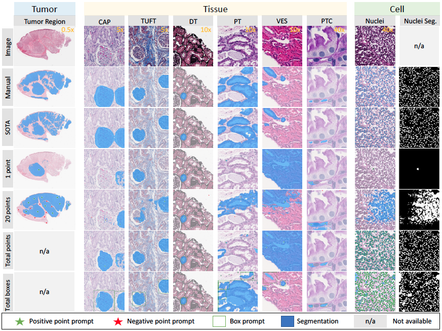
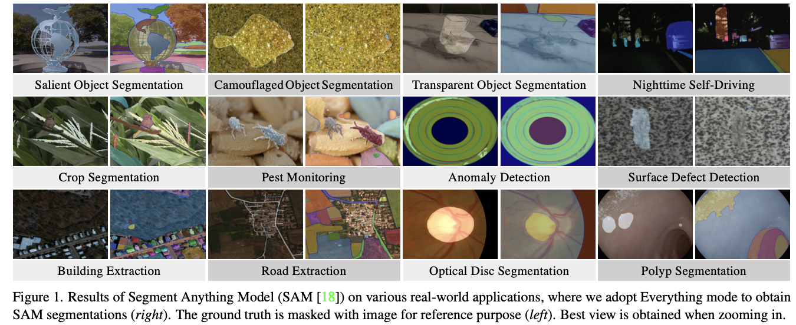
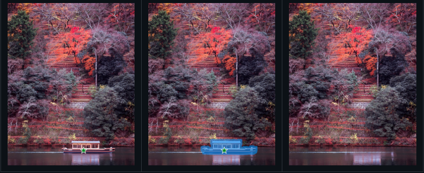
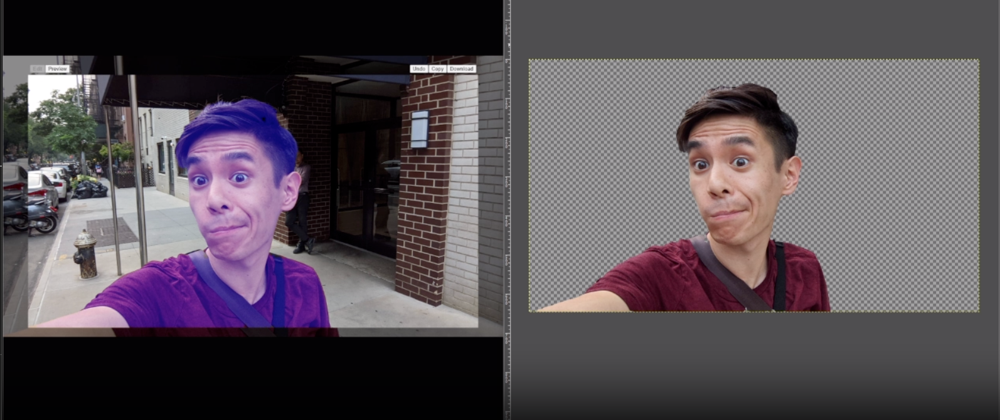
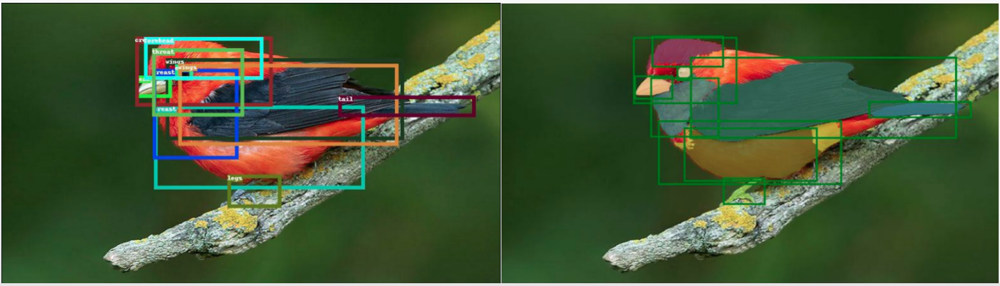
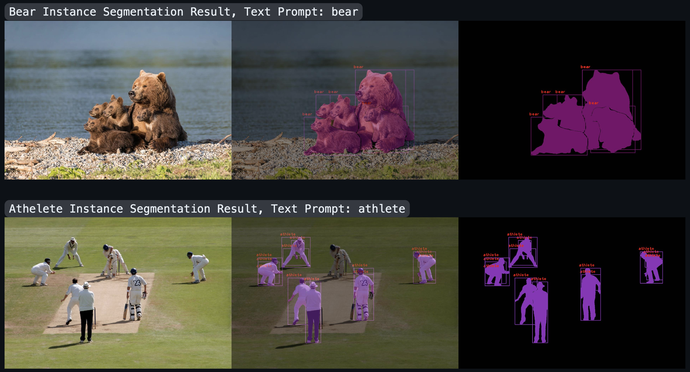
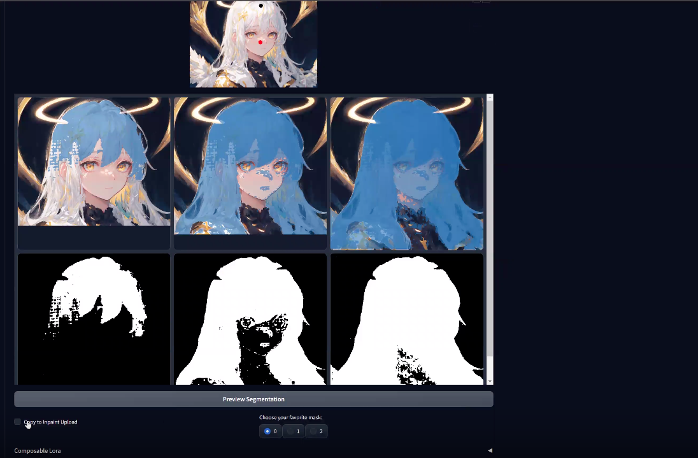

<div align="center">
<br>
<image src="./imgs/teaser.png", width="600px", height="287px">
<br>
</div>
<!--  -->

# Awesome Segment Anything [](https://github.com/sindresorhus/awesome)
Segment Anything has led to a new breakthrough in the field of Computer Vision (CV), and this repository will continue to track and summarize the research progress of Segment Anything in various fields, including Papers/Projects, etc. 

If you find this repository helpful, please consider Stars ⭐ or Sharing ⬆️. Thanks.

## News
```
- 2023.4.18: Add two nice job Inpainting Anything and SAM-Track.
- 2023.4.12: Add some presentations.
- 2023.4.12: An initial version of recent papers or projects.
```

## Contents

- [Basemodel Papers](#basemodel-papers) 
- [Derivative Papers](#derivative-papers)
- [Derivative Projects](#derivative-projects) 
  - [Image Segmentation task](#image-segmentation-task)
  - [Video Segmentation task](#video-segmentation-task)
  - [Medical image Segmentation task](#medical-image-segmentation-task)
  - [Inpainting task](#inpainting-task)
  - [3D task](#3d-task)
  - [Image Generation task](#image-generation-task)
  - [Remote Sensing task](#remote-sensing-task)
  - [Moving Object Detection task](#moving-object-detection-task)
  - [OCR task](#ocr-task)

## Papers/Projects
### Basemodel Papers
| Title |Presentation| Paper page | Project page | Code base | Affiliation| Description|
|:---:|:---:|:---:|:---:| :---:| :---:|:---:|
| CLIP |  | [arXiv](https://arxiv.org/abs/2103.00020) | [Colab](https://colab.research.google.com/github/openai/clip/blob/master/notebooks/Interacting_with_CLIP.ipynb) | [Code](https://github.com/openai/CLIP) | OpenAI | Contrastive Language-Image Pre-Training.| 
| OWL-ViT | | [ECCV2022](https://arxiv.org/abs/2205.06230) | - | [Code](https://github.com/google-research/scenic/tree/main/scenic/projects/owl_vit) | Google | A open-vocabulary object detector. | 
| OvSeg |  | [CVPR2023](https://arxiv.org/abs/2210.04150) | [Project](https://jeff-liangf.github.io/projects/ovseg/) | [Code](https://github.com/facebookresearch/ov-seg) | META | Segment an image into semantic regions according to text descriptions.| 
| Painter |  | [CVPR2023](https://arxiv.org/abs/2212.02499) | - | [Code](https://github.com/baaivision/Painter) | BAAI | A Generalist Painter for In-Context Visual Learning.| 
| Grounding DINO | | [arXiv](https://arxiv.org/abs/2303.05499) | [Colab](https://colab.research.google.com/github/roboflow-ai/notebooks/blob/main/notebooks/zero-shot-object-detection-with-grounding-dino.ipynb) &[Huggingface](https://huggingface.co/spaces/ShilongLiu/Grounding_DINO_demo) | [Code](https://github.com/IDEA-Research/GroundingDINO) | IDEA | A stronger open-set object detector|
| Segment Anything | | [arXiv](https://arxiv.org/abs/2304.02643) | [Project page](https://segment-anything.com/) | [Code](https://github.com/facebookresearch/segment-anything) | Meta | A stronger Large model which can be used to generate masks for all objects in an image.| 
| SegGPT | | [arXiv](https://arxiv.org/abs/2304.03284) | [Project page](https://huggingface.co/spaces/BAAI/SegGPT) | [Code](https://github.com/baaivision/Painter) | BAAI | Segmenting Everything In Context based on Painter.|

### Derivative Papers
| Title | Presentation| Paper page | Project page | Code base | Affiliation| Description|
|:---:|:---:|:---:|:---:| :---:| :---:|:---:|
| CLIP_Surgery | | [arXiv](https://arxiv.org/pdf/2304.05653.pdf) |[Demo](https://github.com/xmed-lab/CLIP_Surgery/blob/master/demo.ipynb)| [Code](https://github.com/xmed-lab/CLIP_Surgery) | HKUST | This work about SAM based on CLIP's explainability to achieve text to mask without manual points.|
| Segment Anything Model (SAM) for Digital Pathology |  | [arXiv](https://arxiv.org/abs/2304.04155) | - | - | - | SAM + Tumor segmentation/Tissue segmentation/Cell nuclei segmentation. |
| SAMCOD | - | [arXiv](https://arxiv.org/abs/2304.04709) | - | [Code](https://github.com/luckybird1994/SAMCOD) | - | SAM + Camouflaged object detection (COD) task.|
| Segment Anything Is Not Always Perfect |  | [arXiv](https://arxiv.org/pdf/2304.05750.pdf) | - | - | Samsung | This paper analyze and discuss the benefits and limitations of SAM.|
| Inpaint Anything | |[arXiv](https://arxiv.org/abs/2304.06790)| - |[Code](https://github.com/geekyutao/Inpaint-Anything) | USTC & EIT | SAM + Inpainting, which is able to remove the object smoothly.|

### Derivative Projects
#### Image Segmentation task
| Title | Presentation|  Project page | Code base | Affiliation| Description|
|:---:|:---:|:---:|:---:| :---:| :---:|
| Grounded Segment Anything | |[Colab](https://github.com/camenduru/grounded-segment-anything-colab) & [Huggingface](https://huggingface.co/spaces/yizhangliu/Grounded-Segment-Anything) | [Code](https://github.com/IDEA-Research/Grounded-Segment-Anything) | - | Combining Grounding DINO and Segment Anything| - | 
| GroundedSAM Anomaly Detection |  | - | [Code](https://github.com/caoyunkang/GroundedSAM-zero-shot-anomaly-detection)| - | Grounding DINO + SAM to segment any anomaly. |
| Semantic Segment Anything |  |- | [Code](https://github.com/fudan-zvg/Semantic-Segment-Anything) | Fudan | A dense category annotation engine. |
| Magic Copy |  | - |[Code](https://github.com/kevmo314/magic-copy) | - | Magic Copy is a Chrome extension that uses SAM. |
| Segment Anything with Clip |  |  - |[Code](https://github.com/Curt-Park/segment-anything-with-clip) | -  | SAM + CLIP| 
| SAM-Clip |  | - |[Code](https://github.com/maxi-w/CLIP-SAM) | - | SAM + CLIP.| 
| Prompt Segment Anything | | - | [Code](https://github.com/RockeyCoss/Prompt-Segment-Anything)| - | SAM + Zero-shot Instance Segmentation.|
| RefSAM | - | - |[Code](https://github.com/helblazer811/RefSAM) | - | Evaluating the basic performance of SAM on the Referring Image Segmementation task.| 
| SAM-RBox |  | - |[Code](https://github.com/Li-Qingyun/sam-mmrotate) | - | An implementation of SAM for generating rotated bounding boxes with MMRotate.|
| Open Vocabulary Segment Anything | | - |[Code](https://github.com/ngthanhtin/owlvit_segment_anything) | - | An interesting demo by combining OWL-ViT of Google and SAM.|
| SegDrawer | | - |[Code](https://github.com/lujiazho/SegDrawer) | - | Simple static web-based mask drawer, supporting semantic drawing with SAM.|
| Annotation Anything Pipeline | | [YoutubeDemo](https://www.youtube.com/watch?v=5iQSGL7ebXE) |[Code](https://github.com/vietanhdev/anylabeling) | - | SAM + Labelme + LabelImg + Auto-labeling.|
| AnyLabel | | - |[Code](https://github.com/Yuqifan1117/Annotation-anything-pipeline) | - | GPT + SAM.|
| Roboflow Annotate | | - |[Blog](https://blog.roboflow.com/label-data-segment-anything-model-sam/) & [App](https://app.roboflow.com) | Roboflow | SAM-assisted labeling for training computer vision models.|
| SALT | | - |[Code](https://github.com/anuragxel/salt) | - | A tool that adds a basic interface for image labeling and saves the generated masks in COCO format.]
| SAM U Specify | | - |[Code](https://github.com/MaybeShewill-CV/segment-anything-u-specify) | - | Use SAM and CLIP model to segment unique instances you want.]


#### Video Segmentation task
| Title | Presentation| Project page | Code base | Affiliation| Description|
|:---:|:---:|:---:|:---:| :---:| :---:| 
| MetaSeg |  |[HuggingFace](https://huggingface.co/spaces/ArtGAN/Segment-Anything-Video) |[Code](https://github.com/kadirnar/segment-anything-video) | - | SAM + Video. |
| SAM-Track | [Video](https://www.youtube.com/watch?v=UPhtpf1k6HA&feature=youtu.be&themeRefresh=1) |[YoutubeDemo](https://www.youtube.com/watch?v=Xyd54AngvV8) |[Code](https://github.com/z-x-yang/Segment-and-Track-Anything) | - | This project, which is based on SAM and DeAOT, focuses on segmenting and tracking objects in videos. |

#### Medical image Segmentation task
| Title | Presentation|  Project page | Code base | Affiliation| Description|
|:---:|:---:|:---:|:---:| :---:| :---:| 
| SAM in Napari |[Video](https://www.youtube.com/watch?v=OPE1Xnw487E)|- |[Code](https://github.com/MIC-DKFZ/napari-sam) | - | Segment anything with Napari integration of SAM.|
| SAM Medical Imaging ||- |[Code](https://github.com/amine0110/SAM-Medical-Imaging) | - | SAM for Medical Imaging.|

#### Inpainting task
| Title | Presentation|  Project page | Code base | Affiliation| Description|
|:---:|:---:|:---:|:---:| :---:| :---:| 
| SegAnythingPro | |- |[Code](https://github.com/jinfagang/Disappear) | - | SAM + Inpainting/Replacing.|


#### 3D task
| Title | Presentation|  Project page | Code base | Affiliation| Description|
|:---:|:---:|:---:|:---:| :---:| :---:| 
| 3D-Box | |- |[Code](https://github.com/dvlab-research/3D-Box-Segment-Anything) | - | SAM is extended to 3D perception by combining it with VoxelNeXt.|
| Anything 3DNovel View | |- |[Code](https://github.com/Anything-of-anything/Anything-3D) | - | SAM + [Zero 1-to-3](https://github.com/cvlab-columbia/zero123).|
| Any 3DFace | |- |[Code](https://github.com/Anything-of-anything/Anything-3D) | - | SAM + [HRN](https://younglbw.github.io/HRN-homepage/).|

#### Image Generation task
| Title | Presentation| Project page | Code base | Affiliation| Description|
|:---:|:---:|:---:|:---:| :---:| :---:| 
| Edit Anything |  | - |[Code](https://github.com/sail-sg/EditAnything) | - | Edit and Generate Anything in an image.|
| Image Edit Anything || - |[Code](https://github.com/feizc/IEA) | - | Stable Diffusion + SAM.|
| SAM for Stable Diffusion Webui || - |[Code](https://github.com/continue-revolution/sd-webui-segment-anything) | - | Stable Diffusion + SAM.|

#### Remote Sensing task
| Title | Presentation| Project page | Code base | Affiliation| Description|
|:---:|:---:|:---:|:---:| :---:| :---:| 
| Earth Observation Tools |  |[Colab](https://colab.research.google.com/drive/1RC1V68tD1O-YissBq9nOvS2PHEjAsFkA?usp=share_link) |[Code](https://github.com/aliaksandr960/segment-anything-eo) | - | SAM + Remote Sensing. |

#### Moving Object Detection task
| Title | Presentation| Project page | Code base | Affiliation| Description|
|:---:|:---:|:---:|:---:| :---:| :---:| 
| Moving Object Detection |  | - |[Code](https://github.com/achalddave/segment-any-moving) | - | SAM + Moving Object Detection. |


#### OCR task
| Title | Presentation| Project page | Code base | Affiliation| Description|
|:---:|:---:|:---:|:---:| :---:| :---:| 
| OCR-SAM |  | [Blog](https://www.zhihu.com/question/593914819/answer/2976012032)|[Code](https://github.com/yeungchenwa/OCR-SAM) | - | Optical Character Recognition with SAM. |

## Acknowledgement
Some of the presentations in this repository are borrowed from the original author, and we are very thankful for their contribution.

## License
This project is released under the MIT license. Please see the [LICENSE](LICENSE) file for more information.
